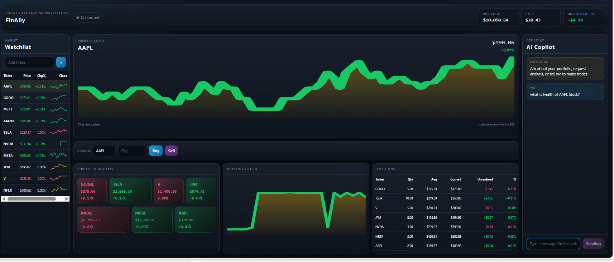

# FinAlly

FinAlly is a single-user AI trading workstation for students. It runs as one local app on port `8000` and combines live market streaming, a simulated portfolio, trading controls, and an AI assistant that can analyze positions and execute actions.



## Current Functionality

- Live watchlist with streaming price updates over SSE
- Simulator-first market data with optional Massive integration
- Portfolio dashboard with total value, cash, unrealized P&L, position heatmap, and portfolio history chart
- Per-symbol primary chart backed by cached price history
- Watchlist management from the UI and API
- Buy and sell trade execution against the simulated portfolio
- AI copilot chat that can discuss the portfolio, place trades, and update the watchlist
- FastAPI backend serving both the JSON API and the generated static frontend
- Docker-based single-container startup flow for students

## Stack

- Frontend: Next.js static export with TypeScript
- Backend: FastAPI, SQLite, `uv`
- Real-time: Server-Sent Events
- AI: LiteLLM with OpenRouter
- Runtime: single Docker container on port `8000`

## Student Launch

1. Copy `.env.example` to `.env`.
2. Set `OPENROUTER_API_KEY` in `.env`.
3. Optionally set `MASSIVE_API_KEY` to use live market data instead of the simulator.
4. Start the app:

```bash
./scripts/start_mac.sh
```

```powershell
.\scripts\start_windows.ps1
```

Open `http://localhost:8000`.

The startup scripts fail fast before `docker run` when `.env` is missing or `OPENROUTER_API_KEY` is blank.

## Start And Stop

```bash
./scripts/start_mac.sh
./scripts/stop_mac.sh
```

```powershell
.\scripts\start_windows.ps1
.\scripts\stop_windows.ps1
```

Use `--build` with the start scripts when you need a fresh image rebuild.

## Source Development

Backend:

```bash
cd backend
uv sync --dev
uv run uvicorn app.main:app --reload --port 8000
```

Frontend:

```bash
cd frontend
npm install
npm run dev
```

If you change the frontend source, rebuild the static export before rebuilding Docker:

```bash
cd frontend
npm run build:sync
```

## Environment Variables

| Variable | Required | Description |
|---|---|---|
| `OPENROUTER_API_KEY` | Yes | Required for startup and the live AI assistant |
| `MASSIVE_API_KEY` | No | Enables real market data; omit it to use simulator mode |
| `LLM_MOCK` | No | Useful for deterministic test and smoke flows |

## Testing

```bash
python3 scripts/test_startup_preflight.py
```

```bash
python3 scripts/smoke_start_command.py
```

```bash
cd backend
uv run pytest tests/ -v
```

```bash
cd test
docker compose -f docker-compose.test.yml up --abort-on-container-exit --exit-code-from playwright
```

The Playwright suite currently covers launch and frontend export reproducibility flows.

## GSD Note

This repository uses GSD planning artifacts under `.planning/` and local workflow support files under `.codex/`.

- `planning/PLAN.md` defines the intended end-state for the project.
- `.planning/STATE.md` tracks current execution state.
- `.codex/` contains the local Get Shit Done workflow scaffolding used to manage planning and execution in this workspace.

These files are part of the working process for the project and are expected to evolve with the implementation.

## Troubleshooting

- If startup exits immediately, check that `.env` exists and `OPENROUTER_API_KEY` is set.
- If market data looks static, confirm whether you are intentionally running in simulator mode without `MASSIVE_API_KEY`.
- If the frontend looks stale after a source change, run `cd frontend && npm run build:sync`.
